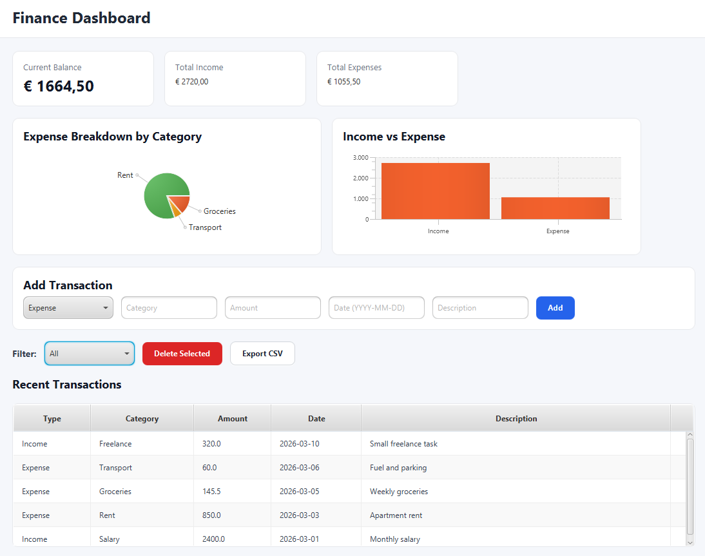
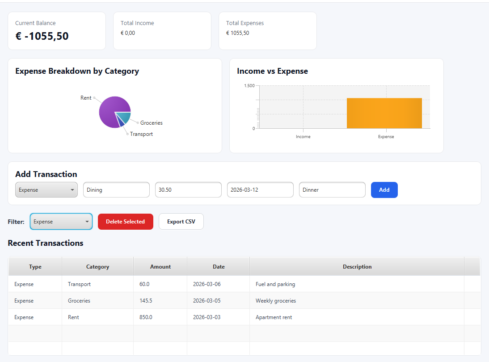

# Java Finance Tracker

A desktop finance tracking application built with **JavaFX**, **SQLite**, and **Maven**.

This project was built to practice Java desktop development, local database persistence, and user-focused UI design. It allows users to manage income and expenses, monitor balance, visualize spending, and export transaction data to CSV.

---

## Features

- Add income and expense transactions
- Store transactions in a local SQLite database
- View transactions in a table
- Display summary cards for:
  - current balance
  - total income
  - total expenses
- Filter transactions by type
- Delete selected transactions
- Export transactions to CSV
- Visualize:
  - expense breakdown by category
  - income vs expense summary

---

## Tech Stack

- Java 17
- JavaFX
- Maven
- SQLite
- JDBC

---

## Project Structure

```text
java-finance-tracker
│
├── .mvn
├── data
│   ├── finance_tracker.db
│   └── transactions_export.csv
├── docs
│   ├── dashboard-overview.png
│   └── add-transaction.png
├── src
│   └── main
│       ├── java
│       │   └── com
│       │       └── financetracker
│       │           ├── app
│       │           ├── controller
│       │           ├── model
│       │           └── service
│       └── resources
│           ├── fxml
│           └── styles
├── .gitignore
├── mvnw
├── mvnw.cmd
├── pom.xml
└── README.md
```

---

## How It Works

The application uses a local SQLite database to store transactions.

### Workflow

1. The application starts and initializes the database
2. Sample transactions are inserted if the database is empty
3. Transactions are loaded into the table view
4. The dashboard calculates:
   - total income
   - total expenses
   - balance
5. Charts update automatically
6. Users can add, filter, delete, and export transactions

---

## Running the Application

### Option 1 — Using Maven

```bash
mvn javafx:run
```

### Option 2 — Using Maven Wrapper

**Windows**

```cmd
mvnw.cmd javafx:run
```

**Linux / macOS**

```bash
./mvnw javafx:run
```

---

## Screenshots

### Dashboard Overview



### Add Transaction Flow



---

## Export Output

The CSV export is saved to:

```text
data/transactions_export.csv
```

---

## Why I Built This

I wanted to build a Java desktop application that felt practical and polished rather than academic. This project helped me practice:

- JavaFX GUI development
- SQLite database integration
- financial data processing
- chart-based visualization
- application structure with Maven

---

## Limitations

- Date input currently uses a text field instead of a date picker
- Filtering only supports transaction type
- Editing existing transactions is not implemented yet
- CSV export always saves to a fixed local path

---

## Future Improvements

- Edit existing transactions
- Add category-based filtering
- Add date range filtering
- Add a monthly spending report
- Improve input validation
- Add unit tests for database logic
- Package the application as an executable desktop release

---

## Status

Fully functional desktop application with all core features implemented. Built as a portfolio project to demonstrate Java, JavaFX, and database integration skills.